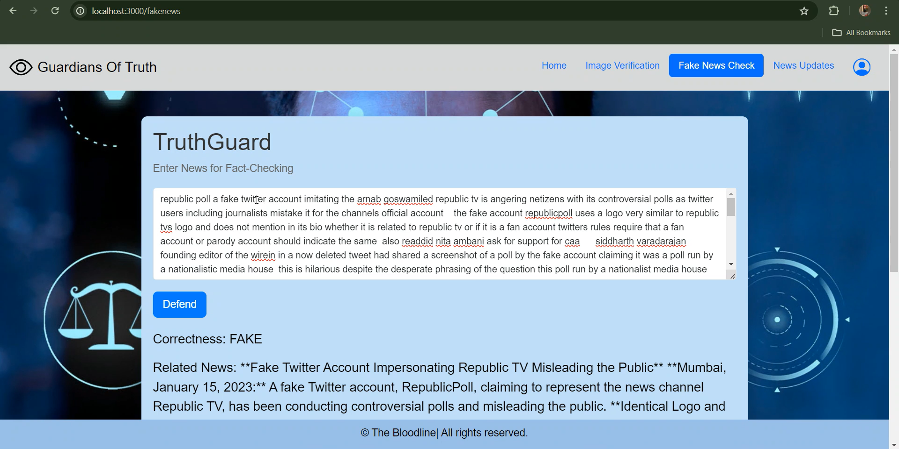
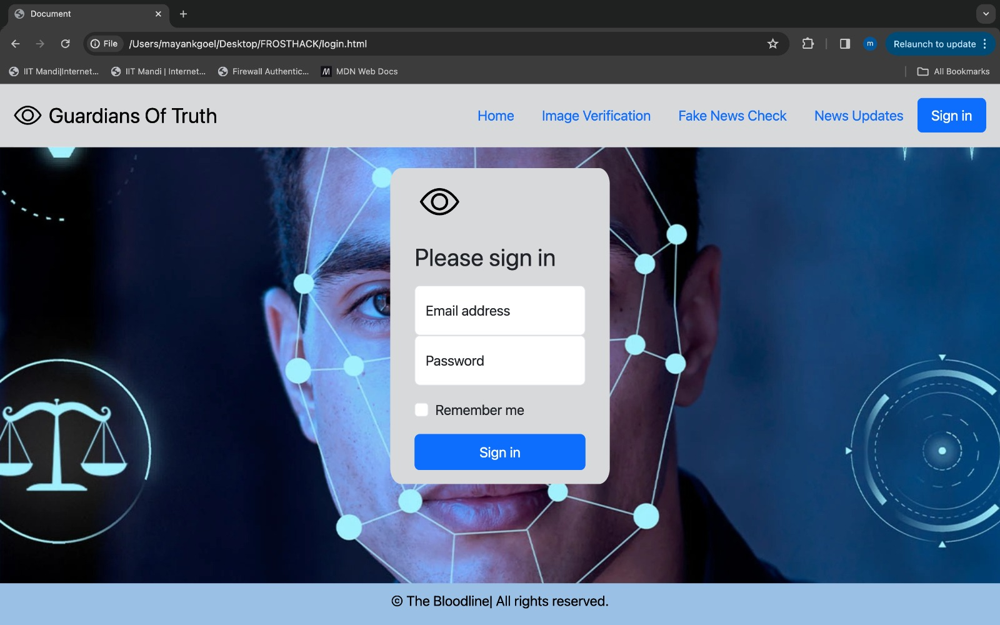
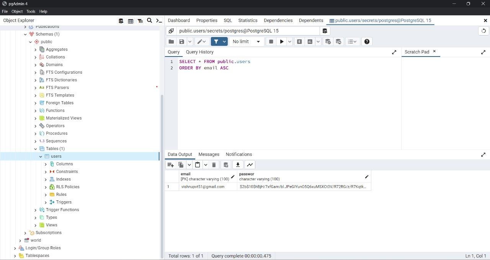
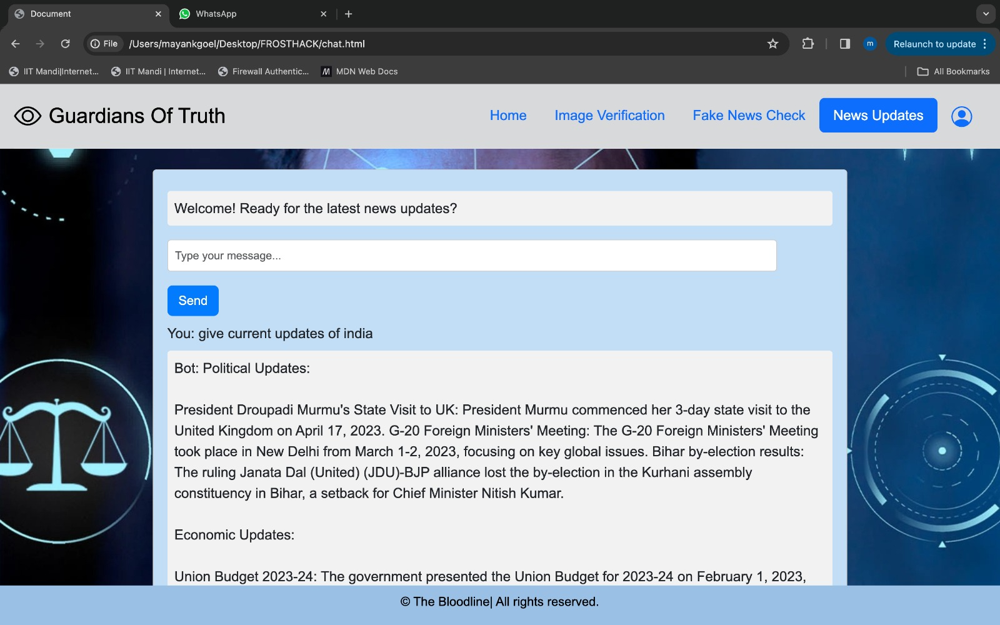

# *Frosthack 2k24*

## *Theme: Unleashing the Power of Generative AI*

### *Problem Statement*
*Guardians of Truth* : The spread of misinformation through deepfakes and fake news threatens trust online. Develop AI powered solutions to combat these issues

### *Solution*
In the era of rampant deepfakes and misinformation, Project Bloodline confronts these rising threats. Our platform safeguards users from deceptive content while providing reliable news updates, empowering them to stay informed and resist manipulation. 

### Table of Contents
1. [Introduction](#introduction)
2. [Tech Stack](#tech-stack)
3. [Dataset](#dataset)
4. [Functioning of model](#functioning-of-model)
5. [Features](#features)
6. [Quick Start](#quick-start)
7. [Demo](#demo)

## Introduction

In today's digital landscape, the proliferation of deepfake technology and fake news poses significant threats to society. Deepfakes, which are highly realistic manipulated media, have the potential to deceive individuals and manipulate public opinion. Similarly, the spread of fake news undermines trust in information sources and leads to widespread misinformation. Recognizing the urgent need to address these challenges, our team has developed the Bloodline project, which offers a suite of tools designed to safeguard individuals from the perils of manipulated media and false information.

*Key Features*

- **Guardian (Deepfake Detection):**  Advanced AI model that analyzes images to expose deepfakes, protecting users from manipulated media.
- 
- **TruthGuard (Fake News Detection):** Combats the spread of misinformation by pinpointing fake news articles, promoting truth and transparency.
- 
- **News Update (News-Bot):**  Delivers trustworthy news updates from reputable sources, enabling users to stay informed about global events.

## Tech Stack

# *Frontend:* 
  - HTML 
  - CSS
  - JavaScript
  - Bootstrap
# *Backend:*
  - Express.js
  - Node.js
  - PostgreSQL
  - FastAPI 
# *AI Models:*
  - Vision Transformers (Clip ViT-14) [Repo Link](https://github.com/openai/CLIP.git)
  - Fully Connected Neural Network (FCNN)
  - LSTM
  - Gemini
# *Libraries:*
  - FastApi
  - FastAi
  - cv2
  - Pillow
  - Tensorflow

## Dataset

### Deepfake Detection
- **Source:** Collected from various Generative AI (Gen-AI) models, including Generative Adversarial Networks (GAN), Diffusion models, and DALLE.
- **Description:** This dataset comprises a diverse collection of manipulated media generated by cutting-edge AI models. These deepfake videos and images serve as the foundation for training our AI models to accurately detect and classify manipulated content. By leveraging data sourced from state-of-the-art Generative AI models, our deepfake detection system is equipped to identify sophisticated manipulations and ensure the integrity of visual media.

Dataset links:

Diffusion Models: [Link](https://drive.google.com/file/d/1FXlGIRh_Ud3cScMgSVDbEWmPDmjcrm1t/view)

GAN's: [Link](https://drive.google.com/file/d/1z_fD3UKgWQyOTZIBbYSaQ-hz4AzUrLC1/view)

### Fake News Detection
- **Source:** Sourced from Kaggle datasets containing a mixture of authentic and fabricated news articles.
- **Description:** The fake news detection dataset consists of a comprehensive collection of news articles spanning various topics and genres. This dataset enables our AI models to distinguish between genuine and fabricated news content, facilitating the identification and mitigation of misinformation. By training on a diverse range of news articles, our fake news detection system is equipped to combat the spread of false information and promote the dissemination of accurate and reliable news sources.
 
Dataset links:

1. Bharat fake news kosh [Link](https://www.kaggle.com/datasets/man2191989/bharatfakenewskosh)

2. IFND dataset [Link](https://www.kaggle.com/datasets/sonalgarg174/ifnd-dataset)

3. Fake real news : [Link](https://www.kaggle.com/datasets/imbikramsaha/fake-real-news)

## **Functioning of model**
### 1. Guardian: Detection of DeepFake Images
We have implemented deepfake image classification using Progan dataset. It involves reading and preprocessing images from a ProGAN dataset, extracting features using the CLIP (Contrastive Language-Image Pre-training) model, visualizing feature embeddings, and implementing image classification using nearest neighbor and linear classification approaches.

#### Data Reading
- Reading data from **ProGan** (Real and Fake Images) for **Training Phase**
- It iterate over each file and **Reads** the image using cv2.imread()
- It checks if the image is in **RGB Format** and appends the image if it satisfies this criterion
- Now we **Resize** the image into **(224,224,3)** dimensions

#### Preprocessing
- 1. **JPEG Compression** : It converts the format of image to .jpg with 80% 
- 2. **Gaussian Blur** :  It applies a gaussian blur filter with kernel size=(5,5) and std dev=0 to half of the images using np.random.rand()<0.5

 #### Feature Extraction

Features from the images are extracted using the CLIP (Contrastive Language-Image Pre-training) model. The features are then saved for further analysis and classification tasks.

#### Linear Classification Approach

For **Linear Classification**, I am training a neural network using TensorFlow's Keras API **(FCNN network)**

1. **Data Preparation**: `features_real` and `features_fake` are concatenated into `X_train`and corresponding labels `Y_train` are defined. Then both are converted into numpy arrays

2. **Hyperparameters**: 
    - **Batch Size:** 30 (as instructed in the research paper)
    - **Epochs:** 7 (The model acheives a training accuracy of 1 so trained on less no of epochs)

3. **Model Structure**: It consists of two fully connected layers: 
    - First layer has 768 units and uses the ReLU activation function.
    - Output layer has 1 unit with a sigmoid activation function, for binary classification problems.

4. **Model Compilation**: The model is compiled using the Adam optimizer and binary crossentropy loss function. 
    - Used **Adam** as optimizer
    - Used **Binary crossentropy loss** as Loss Function
  
#### Accuracy
- I had trained on Progan image set

| Dataset              |    Accuracy   |     SOTA      |
| -------------------- | ------------- | ------------- |
| CycleGan             |    97.3%      |     98.5%     |
| Dalle and Laion      |    92.9%      |     86.78%    |
| Glide-100 and Laion  |    86.9%      |     79%       |

#### Resullts
In 2021, Washington D.C. was stunned by viral deepfake images of Tom Cruise. Our model can accurately detect real and fake images, providing crucial insights during such incidents.

### 2. TruthGuard: Detection of Fake News

#### **Functioning of model:**
1) News input by user in form of Articles
2) Prediction in terms of real and fake base on our model
3) Providing correct news by integrating Gemini model based on the given article by user

#### Data Reading and preprocessing
- Merged data from multiple sources containing factual and news articles, both real and fake, to create a comprehensive dataset.
- Modified input text by converting it to lowercase, removing digits, new lines, HTTP links, HTML tags, and special characters to ensure uniformity and improve model performance.

##### Data Loading
- Utilizes the TextDataLoaders class from the Fastai library to load the prepared dataset.
- Reads data from CSV files, including news articles labeled as real or fake.

##### Model Architecture
- Implements a text classifier using the AWD_LSTM architecture.
- Utilizes a bidirectional LSTM (Long Short-Term Memory) neural network for text classification.

#### Training of Model
1.  Creating a DataLoader object `dls` containg training and validation data
      - Validation split- 20%

2. Initializes a text classifier model (`learn`) using the AWD-LSTM architecture 

      Specifies the DataLoader (`dls`) and evaluation metric (accuracy).

3. Trraining the text classifier model (`learn`) using the one-cycle policy
   - Epochs=10
   - Learning Rate=0.01

4. Creating an interpretation object (`interp`) from the trained model (`learn`) for classification tasks

5. Generating a confusion matrix plot using the interpretation object (`interp`), showing the performance of the model on different classes.

#### Accuracy:
The model trained using LSTM obtained 93% accuracy
Below is the confusion matrix on training data

#### Responses:

We gave some fake news related to a fake Twitter account impersonating Republic TV is stirring controversy with biased polls, mistaken for the official channel. Despite being called out as parody, it continues to tweet divisive polls, prompting criticism from users.Our model is predicted correctly as fake

We gave another prompt as current news regarding placement scenario in IIT's and model correctly identified the situation.

## Features

### 1. Guardian and TruthGuard AI Models

#### Guardian: Defending Against Deepfakes
Guardian is an advanced AI model specifically designed to analyze images and detect deepfakes. Leveraging state-of-the-art technology, Guardian employs sophisticated algorithms to scrutinize images and identify signs of manipulation. 

By detecting deepfakes, Guardian helps individuals safeguard their online presence and protect themselves from potential harm. Furthermore, Guardian also verifies the authenticity of images, ensuring that users can trust the content they encounter online.

#### TruthGuard: Combatting Fake News
TruthGuard is a powerful tool developed to detect fake news articles and combat the spread of misinformation. Utilizing cutting-edge machine learning techniques, TruthGuard analyzes news content to distinguish between genuine and fabricated information. 

By training on a diverse dataset comprising both real and fake news articles, TruthGuard has been fine-tuned to accurately classify news content and provide users with reliable information. Additionally, TruthGuard cross-references its results with a Gemini model to identify relevant news articles, ensuring that users receive timely and pertinent updates.

### 2. Sign-in Process with Secure Storage

To ensure the security of user data, the Bloodline project implements a robust sign-in process with secure storage mechanisms. Users can securely access the platform by providing their credentials through a POST request system. 

User data is stored in a PostgreSQL database, utilizing industry-standard encryption techniques to safeguard sensitive information. By employing bcrypt hashing for password storage, the Bloodline project prioritizes the protection of user privacy and security.

### 3. Image Verification

The Bloodline project incorporates advanced image verification capabilities to identify and combat deepfakes. Leveraging a comprehensive dataset sourced from state-of-the-art AI models such as GAN and DALL-E, the project's AI models have been trained to recognize patterns indicative of image manipulation.

Using the Clip Vit-14 model for feature extraction, the project's AI accurately classifies images as either genuine or manipulated, providing users with the assurance of authenticity.

### 4. News Update Feature

In today's rapidly evolving world, access to accurate and reliable news is essential for making informed decisions and understanding global events. To facilitate this, the Bloodline project integrates a news-bot feature, providing users with the latest news updates from reputable sources. By aggregating news content from trusted sources, the news-bot ensures that users have access to timely and credible information, enabling them to stay informed and engaged with current affairs.

## Quick Start

## Demo

## Contributors
*Team: The BLOODLINE* 🔥🔥
The project was developed by the following contributors-
  - Toshan Gupta
  - Naman Singhania
  - Mayank Goel
  - Vishnu

